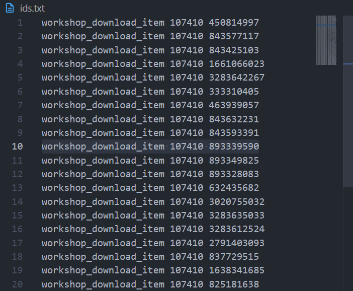

# grabba dinero
this is an **ultra specific** use case script that grabs the steam workshop id's from an `Arma 3 Modpack .html` file and generates steamcmd commands to download them onto my EC2 dedicated instance.

> _more than anything this demonstrates my complete and utter **inability** and **unwillingness** to write bash scripts._

# usage:

### execution
execute `grabber.py` while passing the steam game id and file path to the html/txt file as arguments

```bash
grabber.py {app_id} {{path}/example.html}
```

example: 
```bash
grabber.py 107410 ./modpack.html
```

### output:

`ids.txt` containing a generated steamcmd command to download a mod with the given app id




> questioning why this is even on github is completely fair but i couldnt be fucked to write this script again if i lost it somewhere
